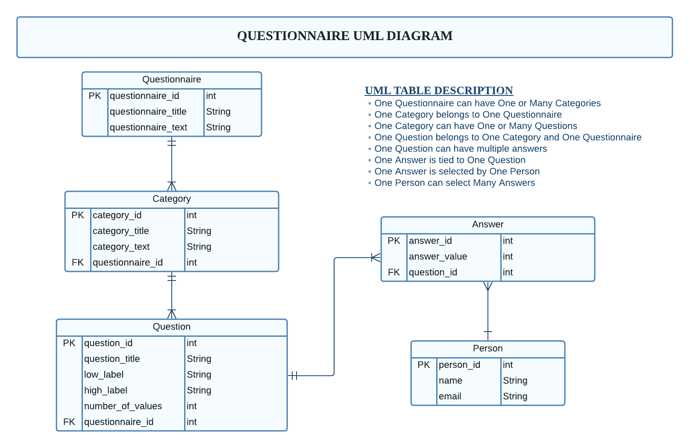
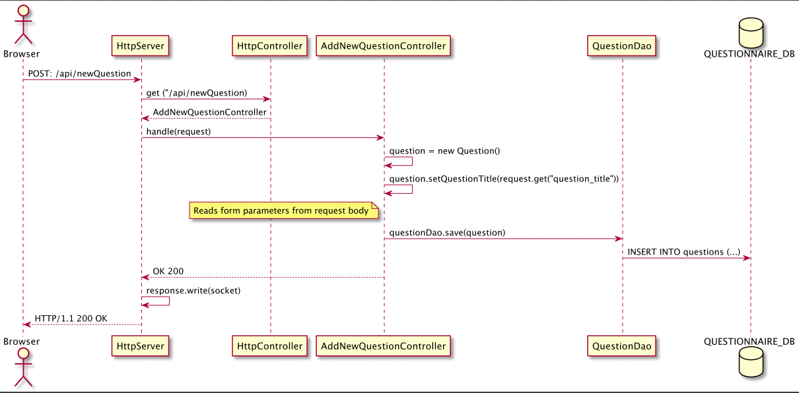

[](https://github.com/kristiania-pgr203-2021/pgr203-exam-ssovesen/actions/workflows/maven.yml)

# Eksamen - PGR203 - Avansert Java

[GitHub Classroom:](https://github.com/kristiania-pgr203-2021/pgr203-exam-ssovesen.git)

## Prosjektets funksjonalitet:

### Webgrensesnittet

Programmet lar brukeren opprette én eller flere brukerundersøkelser med spørsmål og kategorier. Hvert spørsmål har en tittel og kan besvares på en forhåndsbestemt skala. Brukeren kan også slette eller redigere spørsmål om han ønsker. 
En person kan også legge inn informasjon om seg selv, og registere sitt svar på en brukersøkelse. En kan også liste ut en spørreundersøkelse, og se hva gjennomsnittsvaret er.

### Serveren
På baksiden av programmet kjører en webserver som kan liste ut filer, håndtere HTTP forespørsler og lagre / hente ut informasjon fra en database. Denne informasjonen sender serveren tilbake til brukeren. Serveren gir også beskjed om hva som skjer gjennom en egen log.


### Framgangmetoden
Vi begynte å bygge prosjektet gjennom å lage en enkel klient som sender HTTP forespørsler, derettter opprettet vi en server-klasse som tar imot forespørslene og sender svar tilbake. Her sikret vi grunnleggende funksjonalitet som som å dele opp en forespørsel, ta imot informasjon gjennom querier, opprette og endre objekter. Dette ble gjort i en egen HttpReader klasse som håndterer trafikken mellom klient og server.

Det neste steget var å bygge et eller flere Data Access Objects som kunne håndtere operasjoner mot database: Lagre, slette, endre og liste ut informasjon (CRUD - operasjoner). Til slutt bygde vi programmet med forskjellige Controllere som kontroller hva som skal skje på serveren når han mottar en forespørsel. Dette ble gjort for å kunne gjøre små endringer i programmet uten å måtte endre hele serveren hver gang. 


## Hvordan kjøre programmet

For å bygge programmet må man enten kjøre koden `mvn package` i Maven CLI i terminal, hvis man har den eller laste inn koden i et IDE som støtter maven, og pakke det ut derfra. 

Programmet trenger to filer for å kunne kjøre. En .jar fil som er selve programmet, og en properties fil som inneholder informasjon rundt din postgres-database.
Properties filen må hete pgr203.properties og inneholde følgende verdier: 
```
dataSource.url= ...
dataSource.user= ...
dataSource.password= ...
```
Denne filen legges i samme mappe som .jar filen og må være tilstede når man kompilerer programmet. 
Programmet kan kjøres i terminalen ved å skrive kommandoen:

`java -jar pgr203-exam-ssovesen-1.0-SNAPSHOT.jar`

Når programmet kjører kan du bruke webgrensesnittet ved å åpne browseren og gå til [addresen](http://localhost/10001):

``http://localhost:10001``


> NB: Møter du på problemer for å legge inn bruker, kan det være lurt å tømme browseren for cookies.

## Diagram av programmet
UML diagram over databasen og hvordan vi har strukturert informasjonen.



Dette er et diagram som viser hvordan programmet vårt fungerer i en enkel HTTP forespørsel.




# Erfaringen vår
Vi har jobbet veldig hardt med dette prosjektet og er veldig stolte over hvor vi har havnet til slutt. Siden vi har jobbet sammen på tidligere arbeidskrav har vi godt samarbeid, god tillit til hverandre, og dette har bidratt til god kommunikasjon under eksamen. Vi mener at dette har vært viktige faktorer for hva vi har oppnådd.  

Vi begynte med å lese nøye gjennom og kartlegge oppgaveteksten, og hva oppgaven gikk ut på. Så begynte vi å diskutere hvordan løsningen skulle fungere, og samtidig sette opp en plan for hvordan vi skulle gå frem. I planleggingen tegnet vi et UML-diagram over hvordan løsningen kunne se ut, og brukte dette som et visuelt verktøy når vi bygget programmet. Vi gjorde også et UML diagram for hvordan databasen skulle se ut når vi kom så langt. Diagrammene var utgangspunkt for å begynne å kode, og denne måten å planlegge på fungerte godt for samarbeidet. Vi begynte med å par-programmere i begynnelsen, men etterhvert som prosjektet vokste fokusere vi mer på konkrete oppgaver som måtte løses. Vi brukte også testdrevet utvikling som metode under prosjektet, men det var vanskelig å opprettholde til enhver tid - spesielt når vi ikke visste helt hvordan koden skulle se ut til slutt.

Når koden vår ikke fungerte så brukte vi debugger og feilsøking for å løse problemene sammen. Ofte tenker to hoder bedre enn et, og vi klarte å finne ut av feilene. Noen feil var store, mens andre bittesmå, og det viste seg at de bittesmå tok lengst tid å finne. Alt i alt bidro det til at vi har lært masse underveis.  

Hvis vi hadde hatt mer tid til rådighet så ville vi lagt inn mer funksjonalitet. Eksempelvis å endre slette questionnaire/categories og skrive mer utfyllende tester, spesielt for controllere. Vi skulle også likt å kunne ha flere forskjellige typer svar (checkbox, input, dropdown, text osv.). Vi kunne også tenke oss å liste ut alle svar en person har gitt. 


### Ekstra funksjonalitet
* Vi har et avansert datamoddell med totalt 5 tabeller(Question, Questionnaire, Person, Category, og Answer)
* Hvert svar kan besvares på en skala som brukeren velger selv. Brukeren kan også velge merkelapp på laveste og høyeste verdi.
* Et sett med spørsmål kan knyttes sammen til en kategori som igjen knyttes til en spørreundersøkelse.
* Brukeren kan legge inn fornavn, etternavn og e-post, og dette registreres når han/hun besvarer en spørreundersøkelse. Dette kan brukes til å vise alle besvarelse av en person.
* Serveren bruker Cookies sånn at browseren husker innloggingen dersom brukeren kommer tilbake. 
* Vi bruker abstraksjon i både DAO og Controller-klassene. Vi har en AbstractDao klasse som er brukt av alle Dao-klassene og en HttpController med handle() metode som må brukes av alle Controller-klassene.
* Vi har brukt HTTP response 303 for å sende brukeren tilbake til forrige side etter de har utført en POST forespørsel eller lagret noe i databasen.
* Vi har håndtert riktig encoding hvis brukeren skriver på norsk, med bruk av URLDecoder i HttpReader.
* I tilfelle brukeren bare går inn på http://localhost/10001 eller request target "/" får man likevel innholdet av index.html istedenfor en 404 i retur.
* Vi har rammeverk rundt http-håndtering med HttpReader, HttpClient, HttpPostClient
* Vi har laget diagram av hvordan programmet virker samt UML diagram av database tabellene.
* Hvis serveren krasjer, det blir logget og returnerer en status code 500 til brukeren. Brukeren kan fortsatt bruke serveren.
* Vi har laget et favicon til servern vår, som blir skrevet ut riktig via en HTTP respons. Dette fungerer ikke i Chrome eller Safari, fordi de viser ikke favicon på localhost. 
* Vi har skrevet om HttpServer til å bruke en FileController for å lese filer fra disk.
* Vi har refaktorert og fjernet tidligere tester og klasser som var overflødig uten å også fjerne kode som fortsatt har verdi.
* Vi har fikset content-type sånn at CSS fungerer med html-filer som har <!DOCTYPE html>.
* Retrieve metoden i controller har ikke mulighet til å ta inn en ID som ikke finnes i databasen.  


